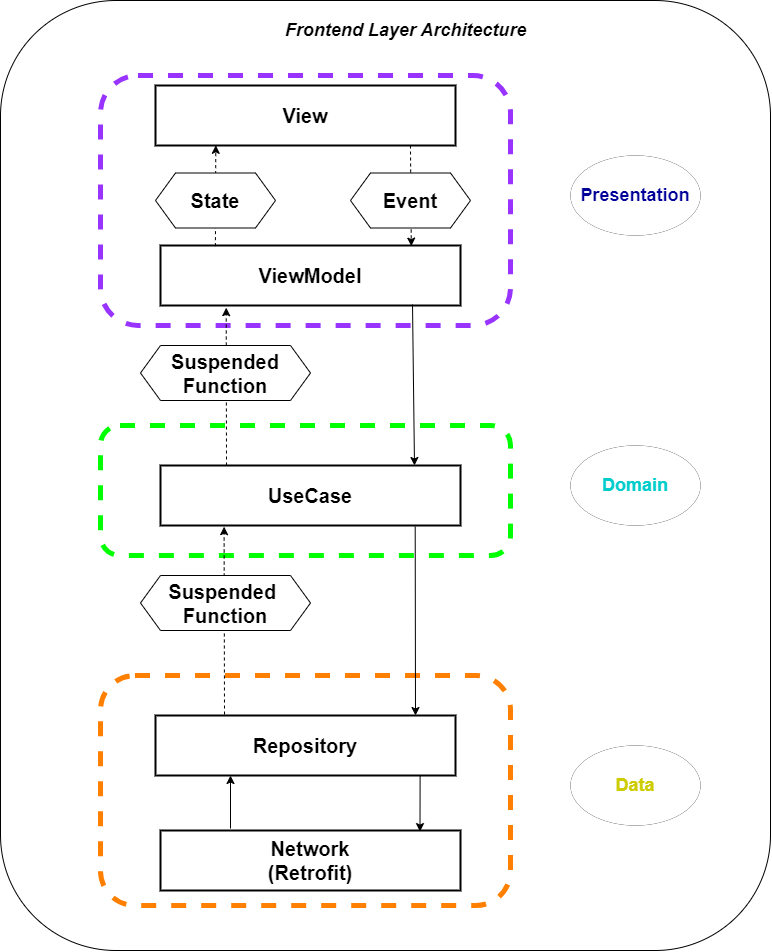
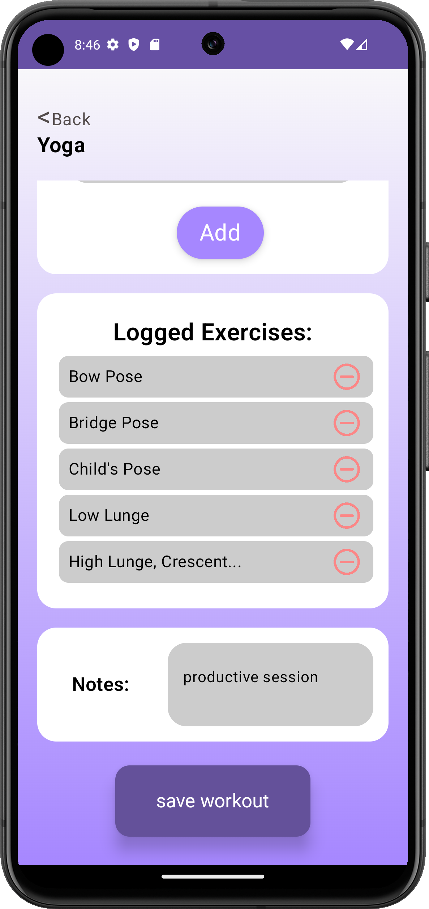

# Happy Habits: Upscale the way you manage your Health ⚕️

  

Are your tired of endless notes on papers, unorganized web and mobile apps for daily tracking. Do you find tiring to log your activities every day ? Are you as a doctor tired of managing your patient daily info ?

`Happy Habits` is a mobile android app, that is designed both for patients and for users. It is a suitable application for daily tracking activity and also bridges the gap between patient and doctor.

### `Happy Habits` is divided into 2 sections:
- 📱 [Mobile-App](../Mobile-App/): Find the frontend and the [UI-UX](#ui-ux) of our app. It has been implemented to be user friendly for the patients and the doctors.
- 🖥️ [API-Server](../API-Server/): This is the core of our app. Here is the implementation of the backend. Every here is connected to server all users. It manages the CRUD operations to the database and functions as a hub for the chat communication.

## 🔑Who can use `Happy Habits` ?
- 🤒 Patients: First and foremost anybody can use the application. But it is especially designed for users who want to:
  * 🔒 Authenticate, sign up and log in.
  * 🗒️ Track their daily activities such as food and medication consumption and others (toilet, workout, sleep, symptoms and mood).
  * 📊 Check statistics for some activities.
  * 💬 Chat and send to doctors their log record.
- 🩺 Doctors: Doctors can also make good use of our app, in order to connect, communicate and receive the records of their patients via email.

To all of the above, patients and doctors can connect using the QR code feature, shown in the [UI-UX](#ui-ux) section.

> ❗ However, the qr code feature can only connect a patient and a doctor, but not two users who belong to the same group
## 🖼️Architecture

  * ### Top Level Architecture
    Here is a diagram which showcases the main components communicate and share information between them. 

    
  * ### Frontend Level Architecture
    As the diagram below shows, frontend design follow the [M(odel)-V(iew)-V(iew)M(odel)](https://en.wikipedia.org/wiki/Model%E2%80%93view%E2%80%93viewmodel) architecture, and also some characteristics of the [Clean](https://www.freecodecamp.org/news/a-quick-introduction-to-clean-architecture-990c014448d2/) architecture.
    
  * ### Backend Level Architecture
    On the other hand, backend design is constructed on the simple Controller-Service-Repository pattern, following the principles of the REST Api architecture.
    

## 🧰🛠️Libraries & Tools
Below there is a list of the main libraries that were used to build our application.
On the mobile app, we used:
  * Retrofit, for the connection with the backend on the Data Layer
  * Coompose, for the UI design
  * Hilt-Dagger, for the Dependency Injection
On the Api, we used:
  * AspNetCore, for the development of the Api
  * MongoDbDriver, for the connection with MongoDb
  * SignalR, for the bidirectional communication between users
  * DinkToPdf, for the creation of PDF files sent to doctors from patients

## 🎨UI-UX
### Doctor Only Screens

  <figure style="margin: 0; text-align: center; flex: 1 1 200px;">
    
    <figcaption>Chat Page</figcaption>
  </figure>
  <figure style="margin: 0; text-align: center; flex: 1 1 200px;">
    
    <figcaption>HomePage</figcaption>
  </figure>
  <figure style="margin: 0; text-align: center; flex: 1 1 200px;">
    
    <figcaption>Inbox</figcaption>
  </figure>
  <figure style="margin: 0; text-align: center; flex: 1 1 200px;">
    
    <figcaption>Profile</figcaption>
  </figure>

### General Screens

  <figure style="margin: 0; text-align: center; flex: 1 1 200px;">
    
    <figcaption>Choose Role</figcaption>
  </figure>
  <figure style="margin: 0; text-align: center; flex: 1 1 200px;">
    
    <figcaption>Choose Role Selected</figcaption>
  </figure>
  <figure style="margin: 0; text-align: center; flex: 1 1 200px;">
    
    <figcaption>LogIn Error</figcaption>
  </figure>
  <figure style="margin: 0; text-align: center; flex: 1 1 200px;">
    
    <figcaption>Loading...</figcaption>
  </figure>

### Authentication Screens

  <figure style="margin: 0; text-align: center; flex: 1 1 200px;">
    
    <figcaption>LogIn</figcaption>
  </figure>
  <figure style="margin: 0; text-align: center; flex: 1 1 200px;">
    
    <figcaption>QR Code Scan</figcaption>
  </figure>
  <figure style="margin: 0; text-align: center; flex: 1 1 200px;">
    
    <figcaption>Share QR Code</figcaption>
  </figure>
  <figure style="margin: 0; text-align: center; flex: 1 1 200px;">
    
    <figcaption>Sign Up</figcaption>
  </figure>
  <figure style="margin: 0; text-align: center; flex: 1 1 200px;">
    
    <figcaption>Splash</figcaption>
  </figure>

### General User Screens

  <figure style="margin: 0; text-align: center; flex: 1 1 200px;">
    
    <figcaption>Home Page</figcaption>
  </figure>
  <figure style="margin: 0; text-align: center; flex: 1 1 200px;">
    
    <figcaption>Inbox User</figcaption>
  </figure>
  <figure style="margin: 0; text-align: center; flex: 1 1 200px;">
    
    <figcaption>User Chat</figcaption>
  </figure>
  <figure style="margin: 0; text-align: center; flex: 1 1 200px;">
    
    <figcaption>User Profile</figcaption>
  </figure>

### Log Habit Screens

  <figure style="margin: 0; text-align: center; flex: 1 1 200px;">
    
    <figcaption>Add medicine</figcaption>
  </figure>
  <figure style="margin: 0; text-align: center; flex: 1 1 200px;">
    
    <figcaption>Add food</figcaption>
  </figure>
  <figure style="margin: 0; text-align: center; flex: 1 1 200px;">
    
    <figcaption>Add medication calendar</figcaption>
  </figure>
  <figure style="margin: 0; text-align: center; flex: 1 1 200px;">
    
    <figcaption>Choose serving</figcaption>
  </figure>
  <figure style="margin: 0; text-align: center; flex: 1 1 200px;">
    
    <figcaption>Daily Stats</figcaption>
  </figure>
  <figure style="margin: 0; text-align: center; flex: 1 1 200px;">
    
    <figcaption>Log food</figcaption>
  </figure>
  <figure style="margin: 0; text-align: center; flex: 1 1 200px;">
    
    <figcaption>Log medication</figcaption>
  </figure>
  <figure style="margin: 0; text-align: center; flex: 1 1 200px;">
    
    <figcaption>Log mood</figcaption>
  </figure><figure style="margin: 0; text-align: center; flex: 1 1 200px;">
    
    <figcaption>Log running</figcaption>
  </figure>
  <figure style="margin: 0; text-align: center; flex: 1 1 200px;">
    
    <figcaption>Log sleep</figcaption>
  </figure>
  <figure style="margin: 0; text-align: center; flex: 1 1 200px;">
    
    <figcaption>Log swimming</figcaption>
  </figure>
  <figure style="margin: 0; text-align: center; flex: 1 1 200px;">
    
    <figcaption>Log toilet activity</figcaption>
  </figure><figure style="margin: 0; text-align: center; flex: 1 1 200px;">
    
    <figcaption>Pick weight exercise</figcaption>
  </figure>
  <figure style="margin: 0; text-align: center; flex: 1 1 200px;">
    
    <figcaption>Log weights</figcaption>
  </figure>
  <figure style="margin: 0; text-align: center; flex: 1 1 200px;">
    
    <figcaption>Set hours in weights</figcaption>
  </figure>
  <figure style="margin: 0; text-align: center; flex: 1 1 200px;">
    
    <figcaption>Log workout</figcaption>
  </figure><figure style="margin: 0; text-align: center; flex: 1 1 200px;">
    
    <figcaption>Log yoga</figcaption>
  </figure>
  <figure style="margin: 0; text-align: center; flex: 1 1 200px;">
    
    <figcaption>Choose yoga activity</figcaption>
  </figure>
  <figure style="margin: 0; text-align: center; flex: 1 1 200px;">
    
    <figcaption>User chat</figcaption>
  </figure>
  <figure style="margin: 0; text-align: center; flex: 1 1 200px;">
    
    <figcaption>Logged yoga activities</figcaption>
  </figure><figure style="margin: 0; text-align: center; flex: 1 1 200px;">
    
    <figcaption>Medication detaiks</figcaption>
  </figure>
  <figure style="margin: 0; text-align: center; flex: 1 1 200px;">
    
    <figcaption></figcaption>
  </figure>
  <figure style="margin: 0; text-align: center; flex: 1 1 200px;">
    
    <figcaption>Share QR Code</figcaption>
  </figure>
  <figure style="margin: 0; text-align: center; flex: 1 1 200px;">
    
    <figcaption>Sign Up</figcaption>
  </figure><figure style="margin: 0; text-align: center; flex: 1 1 200px;">
    
    <figcaption>LogIn</figcaption>
  </figure>
  <figure style="margin: 0; text-align: center; flex: 1 1 200px;">
    
    <figcaption>QR Code Scan</figcaption>
  </figure>
  <figure style="margin: 0; text-align: center; flex: 1 1 200px;">
    
    <figcaption>Share QR Code</figcaption>
  </figure>
  <figure style="margin: 0; text-align: center; flex: 1 1 200px;">
    
    <figcaption>Sign Up</figcaption>
  </figure>
    <figure style="margin: 0; text-align: center; flex: 1 1 200px;">
    
    <figcaption>Sign Up</figcaption>
  </figure>

