# Happy Habits: Upscale the way you manage your Health ⚕️

  

Are you tired of endless notes on papers, unorganized web and mobile apps for daily tracking. Do you find tiring to log your activities every day ? Are you as a doctor tired of managing your patient daily info ?

`Happy Habits` is a mobile android app, that is designed both for patients and for users. It is a suitable application for daily tracking activity and also bridges the gap between patient and doctor.

### `Happy Habits` is divided into 2 sections:
- 📱 [Mobile-App](../Mobile-App/): Find the frontend and the [UI-UX](#ui-ux) of our app. It has been implemented to be user friendly for the patients and the doctors.
- 🖥️ [API-Server](../API-Server/): This is the core of our app. Here is the implementation of the backend. Every here is connected to serve all users. It manages the CRUD operations to the database and functions as a hub for the chat communication.

## 🔑Who can use `Happy Habits` ?
- 🤒 Patients: First and foremost anybody can use the application. But it is especially designed for users who want to:
  * 🔒 Authenticate, sign up and log in.
  * 🗒️ Track their daily activities such as food and medication consumption and others (toilet, workout, sleep, symptoms and mood).
  * 📊 Check statistics for some activities.
  * 💬 Chat and send to doctors their log record.
- 🩺 Doctors: Doctors can also make good use of our app, in order to connect, communicate and receive the records of their patients via email.

To all of the above, patients and doctors can connect using the QR code feature, shown in the [UI-UX](#ui-ux) section.

> ❗ However, the qr code feature can only connect a patient and a doctor, but not two users who belong to the same group
## 🖼️Architecture

  * ### Top Level Architecture
    Here is a diagram which showcases the main components communicate and share information between them. 

    
  * ### Frontend Level Architecture
    As the diagram below shows, frontend design follow the [M(odel)-V(iew)-V(iew)M(odel)](https://en.wikipedia.org/wiki/Model%E2%80%93view%E2%80%93viewmodel) architecture, and also some characteristics of the [Clean](https://www.freecodecamp.org/news/a-quick-introduction-to-clean-architecture-990c014448d2/) architecture.
    
    
  * ### Backend Level Architecture
    On the other hand, backend design is constructed on the simple Controller-Service-Repository pattern, following the principles of the REST Api architecture.
    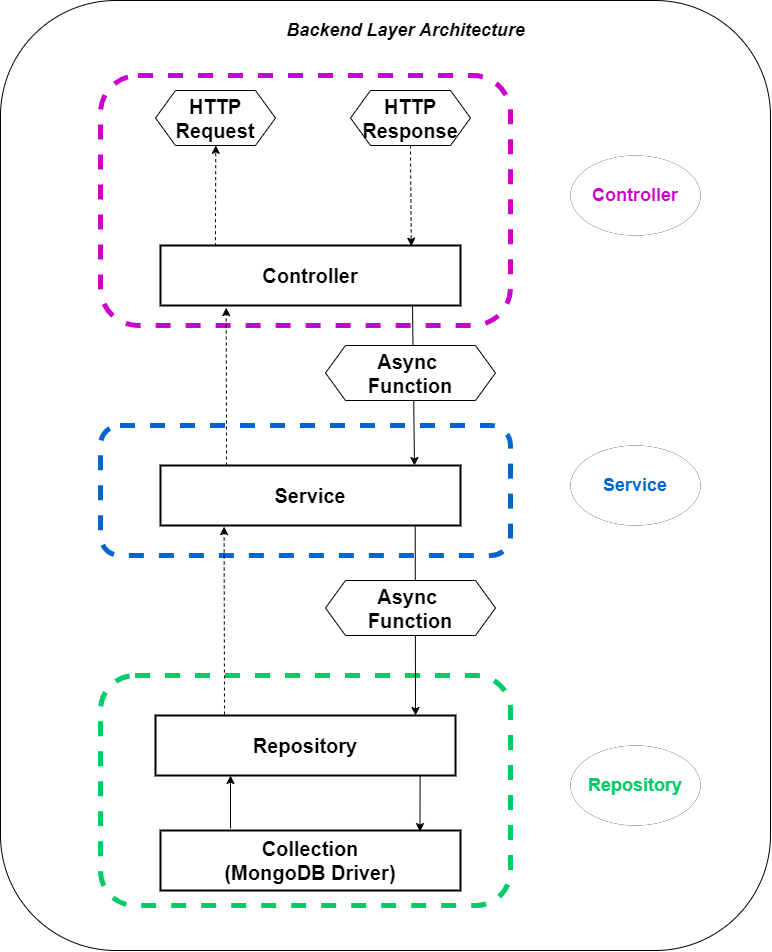

## 🧰🛠️Libraries & Tools
Below there is a list of the main libraries that were used to build our application.
On the mobile app, we used:
  * Retrofit, for the connection with the backend on the Data Layer
  * Coompose, for the UI design
  * Hilt-Dagger, for the Dependency Injection
On the Api, we used:
  * AspNetCore, for the development of the Api
  * MongoDbDriver, for the connection with MongoDb
  * SignalR, for the bidirectional communication between users
  * DinkToPdf, for the creation of PDF files sent to doctors from patients

## 🎨UI-UX
This section provides a comprehensive overview of various screens from the mobile application, categorized by features and user types. Below are the sections:

### Doctor Only Screens

|  |  |  |  |
| --- | --- | --- | --- |
|  |  |  |  |
| **Chat Page** Allows doctors to chat with patients. | **HomePage** Main dashboard for doctors. | **Inbox** Doctors receive messages and notifications here. | **Profile** Doctor’s personal profile and settings. |

---

### General Screens

|  |  |  |  |
| --- | --- | --- | --- |
|  |  | 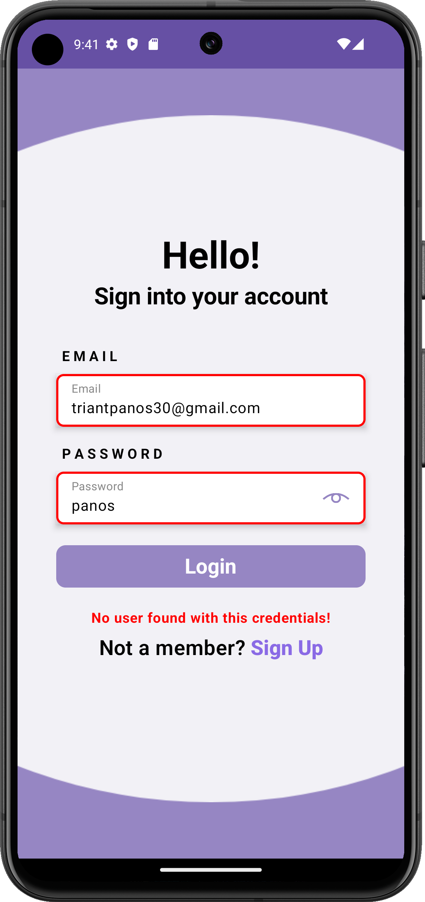 | 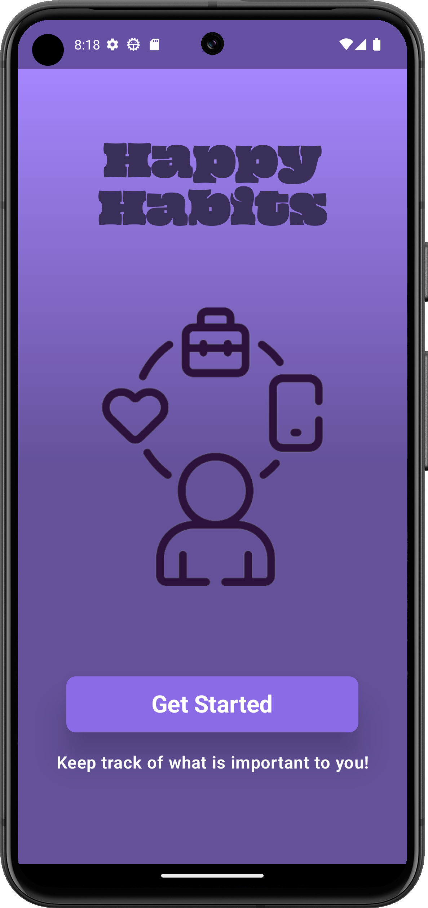 |
| **Choose Role** Choose the user role for accessing the app. | **Choose Role Selected** Role selection confirmation screen. | **LogIn Error** Error message during login. | **Loading** Loading screen while the app is initializing. |

---

### Authentication Screens

|  |  |  |  |
| --- | --- | --- | --- |
|  | 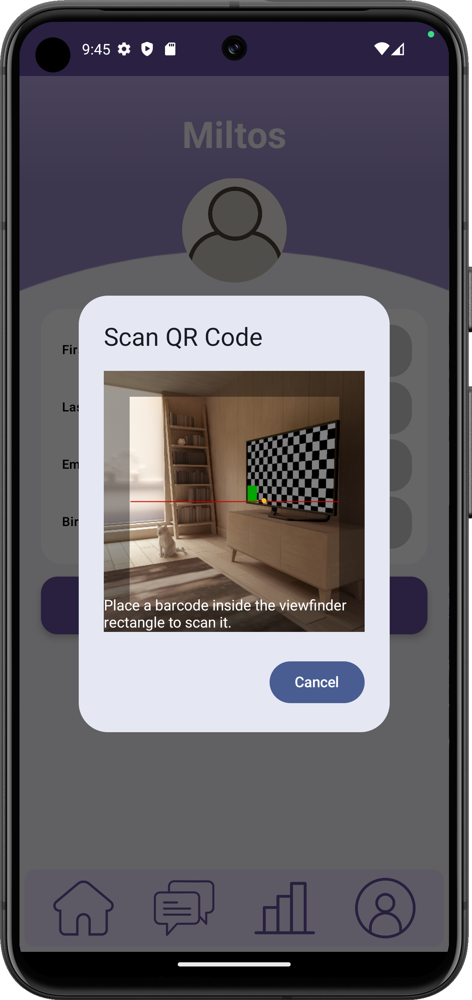 |  |  |
| **LogIn** User login screen. | **QR Code Scan** Scan a QR code for quick access. | **Share QR Code** Option to share the user’s QR code. | **Sign Up** User registration screen. |
|  | | | |
| **Splash** Initial loading screen of the app. | | | |

---

### General User Screens

|  |  |  |  |
| --- | --- | --- | --- |
|  | 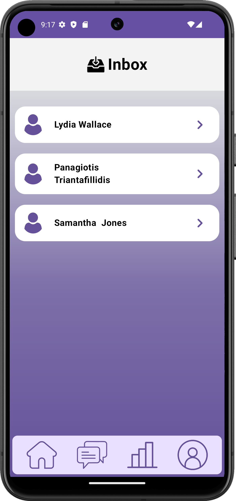 |  |  |
| **Home Page** Main interface for general users. | **Inbox User** User messages and notifications. | **User Chat** Chat interface for users. | **User Profile** User’s personal profile and settings. |

---

### Log Habit Screens

|  |  |  |  |
| --- | --- | --- | --- |
|  |  | 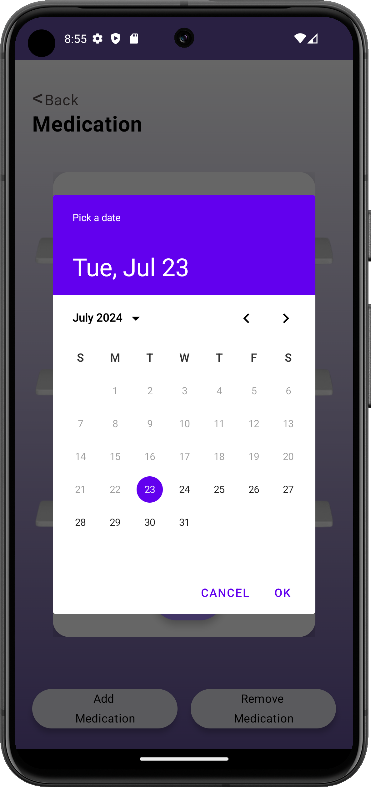 | 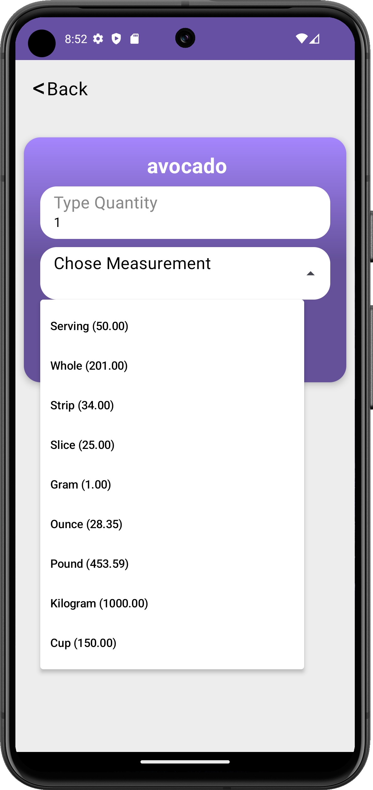 |
| **Add medicine** Screen for adding new medications. | **Add food** Add food items to the log. | **Add medication calendar** Create a medication schedule. | **Choose serving** Select serving sizes for food. |
| 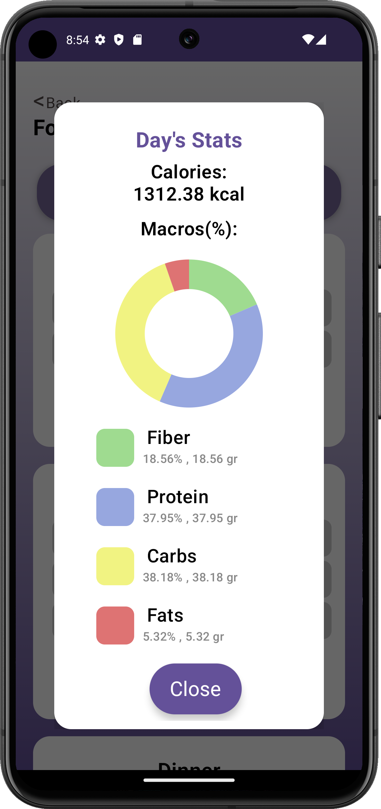 |  |  |  |
| **Daily Stats** View daily health statistics. | **Log food** Input food intake for the day. | **Log medication** Record medications taken. | **Log mood** Track mood and emotional state. |
|  | 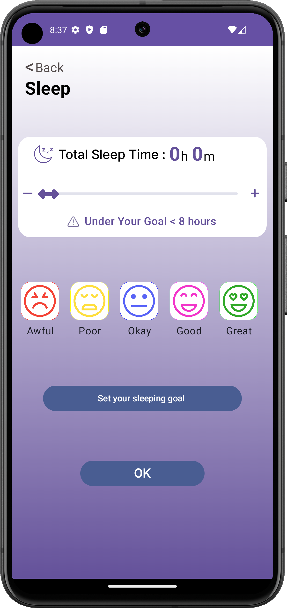 | 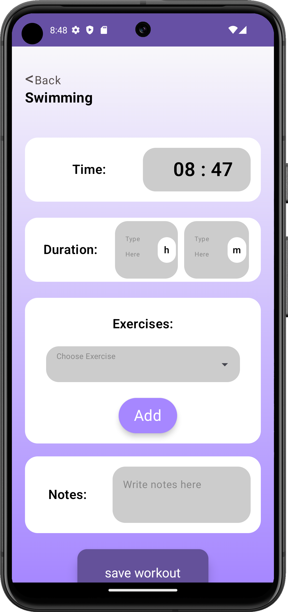 |  |
| **Log running** Record running activities. | **Log sleep** Input sleep duration and quality. | **Log swimming** Track swimming workouts. | **Log toilet activity** Log toilet usage. |
| 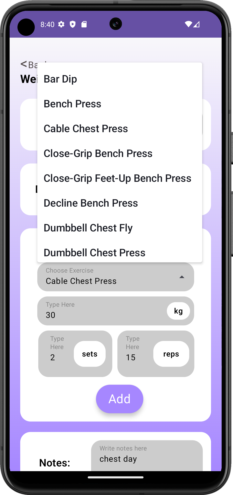 |  | 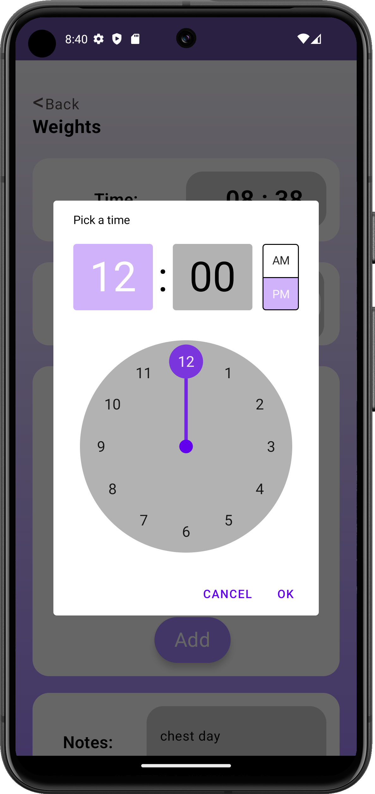 | 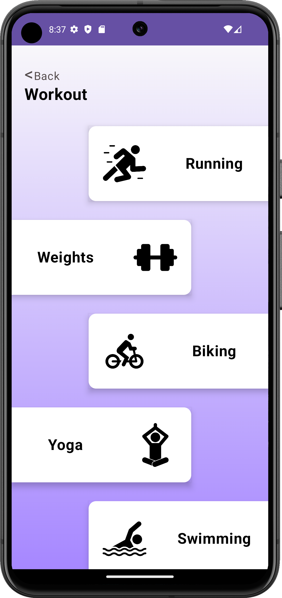 |
| **Pick weight exercise** Select weightlifting exercises. | **Log weights** Record weightlifting activities. | **Set hours in weights** Input weightlifting hours. | **Log workout** Track overall workouts. |
|  | 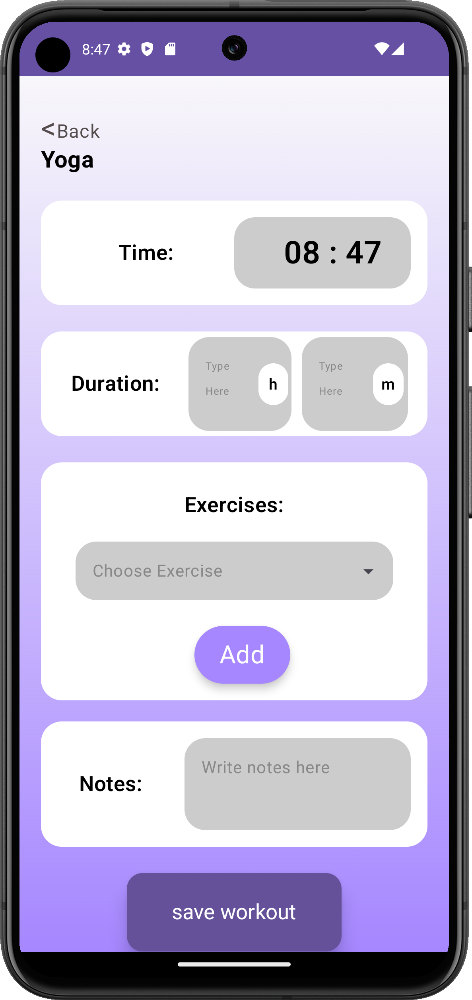 |  |  |
| **Log yoga** Record yoga sessions. | **Choose yoga activity** Select yoga activities. | **User chat** Chat interface for users. | **Logged yoga activities** View logged yoga sessions. |
| 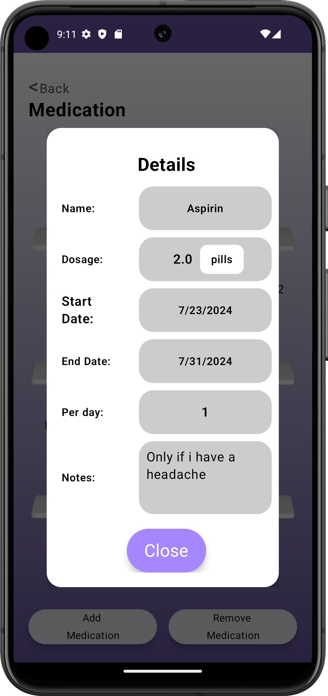 | 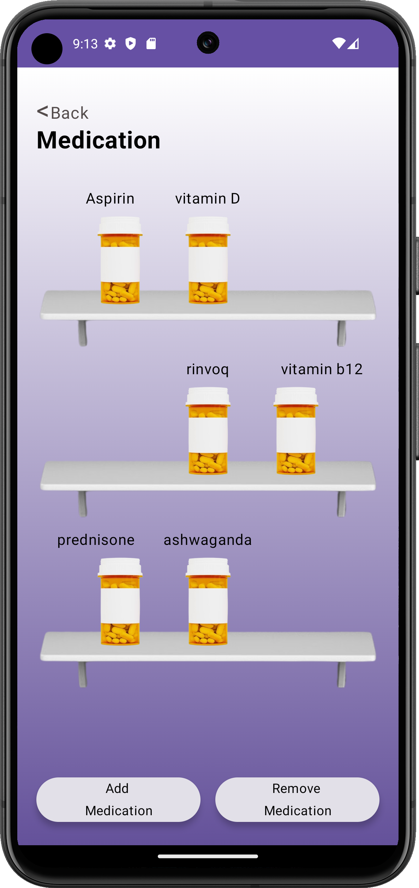 |  |  |
| **Medication details** View details of medications. | **Medication** Medication overview screen. | **Share QR Code** Option to share medication details. | **Sign Up** Option to register new users. |
| 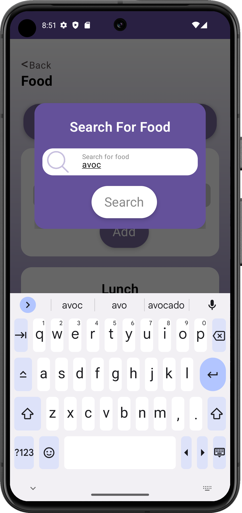 |  |  |  |
| **LogIn** User login screen. | **QR Code Scan** Scan a food QR code. | **Share QR Code** Share food information. | **Sign Up** User registration screen. |
|  | | | |
| **Log weight Exercises** Select weight exercises. | | | |

## 🤝Contributors
* [Lydia Christina Wallace](https://github.com/Lydiacwall)
* [Miltos Tsolkas](https://github.com/miltos02)
* [Panagiotis Triantafillidis](https://github.com/Panattack)
